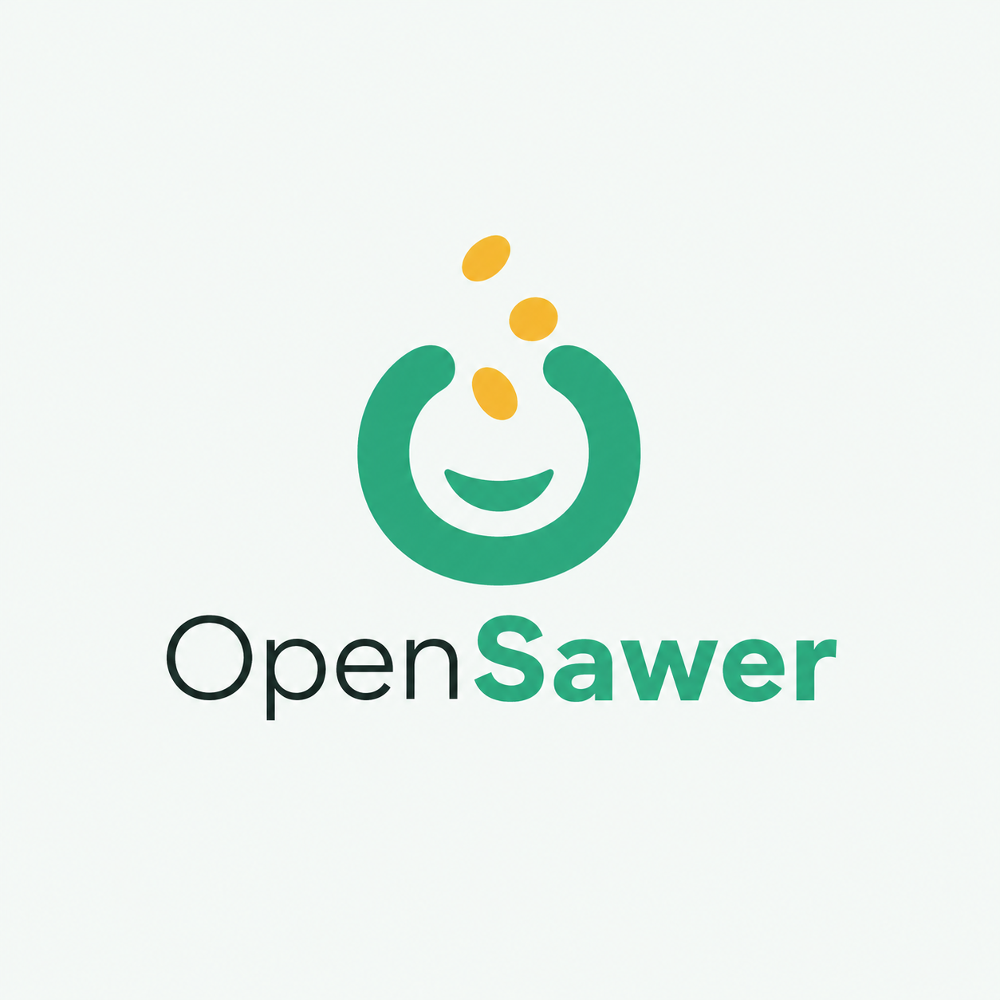

<p align="center">
  
</p>

# OpenSawer

OpenSawer adalah aplikasi donasi sederhana yang bisa dijalankan di server sendiri. Satu instalasi ditujukan untuk satu kreator, komunitas, atau organisasi yang ingin menerima dukungan tanpa bergantung pada platform SaaS pihak ketiga.

Donatur tidak perlu membuat akun. Donasi bersifat anonim secara default; jika ingin memakai identitas publik, donatur dapat memverifikasi username unik melalui Google atau kode email. Pembayaran awal menggunakan Midtrans Snap dan seluruh data aplikasi disimpan di SQLite milik pengelola.

> **Status:** early alpha. Gunakan Midtrans Sandbox dan uji seluruh alur sebelum menjalankan OpenSawer di production.

## Fitur utama

- Halaman profil kreator dengan foto, headline, deskripsi, dan tautan sosial yang dapat diubah.
- Form donasi tanpa akun dengan pilihan anonim, pesan, dan visibilitas nominal.
- Campaign tanpa target atau dengan target donasi.
- Ranking donatur yang menghormati pilihan privasi.
- Verifikasi identitas melalui Google OAuth atau kode email.
- Midtrans Sandbox dan Production, termasuk webhook dan verifikasi status server-side.
- Dashboard admin untuk overview, riwayat, campaign, branding, dan konfigurasi pembayaran.
- Kredensial Midtrans dienkripsi sebelum ditulis ke `.env`.
- SQLite, Docker Compose, dan satu proses Bun—tanpa Redis atau database eksternal.
- Halaman FAQ, ketentuan layanan, dan kebijakan privasi.

OpenSawer bukan marketplace, toko online, layanan penarikan saldo, atau SaaS multi-tenant.

## Quick start lokal

Persyaratan:

- [Bun](https://bun.com/) 1.3.14 atau lebih baru.
- Git.

```bash
git clone https://github.com/wauputr4/OpenSawer.git
cd OpenSawer
cp .env.example .env
bun install --frozen-lockfile
bun run dev
```

Buka:

- Situs publik: `http://localhost:5173`
- Form donasi: `http://localhost:5173/sawer`
- Login admin: `http://localhost:5173/admin/login`

Kredensial development awal:

```text
Username: admin
Password: change-me
```

`.env.example` mengaktifkan `MIDTRANS_MOCK=true`, sehingga UI dapat dicoba tanpa kredensial pembayaran. Kode verifikasi email juga ditampilkan langsung saat development jika SMTP belum diatur. Jangan gunakan kedua perilaku tersebut di production.

## Setup pertama

1. Login ke dashboard admin.
2. Buka **Setting** untuk mengubah nama kreator, headline, foto, favicon, tautan sosial, nominal, dan ranking.
3. Buka **Campaign** untuk membuat atau mengedit tujuan donasi.
4. Di **Setting → Pembayaran**, pilih Sandbox lalu masukkan Merchant ID, Client Key, dan Server Key Midtrans.
5. Klik **Test koneksi & simpan**. OpenSawer menguji key sebelum mengenkripsinya ke `.env`.
6. Kirim donasi sandbox dari `/sawer` dan pastikan status berubah setelah pembayaran terverifikasi.

Donasi anonim langsung tersedia tanpa Google maupun SMTP.

## Konfigurasi penting

Salin `.env.example`, lalu ubah nilai berikut sesuai lingkungan:

| Variabel                        | Kegunaan                                         | Wajib production       |
| ------------------------------- | ------------------------------------------------ | ---------------------- |
| `ORIGIN`                        | URL publik, misalnya `https://sawer.example.com` | Ya                     |
| `OPENSAWER_DB_PATH`             | Lokasi database SQLite                           | Ya                     |
| `OPENSAWER_SESSION_SECRET`      | Penandatangan sesi dan kunci enkripsi kredensial | Ya                     |
| `OPENSAWER_ADMIN_USERNAME`      | Username admin tunggal                           | Ya                     |
| `OPENSAWER_ADMIN_PASSWORD_HASH` | Hash password admin dari Bun                     | Ya                     |
| `MIDTRANS_ENV`                  | `sandbox` atau `production`                      | Ya                     |
| `MIDTRANS_MERCHANT_ID`          | Merchant ID Midtrans                             | Untuk pembayaran nyata |
| `MIDTRANS_CLIENT_KEY`           | Client Key Midtrans; dapat disimpan lewat admin  | Untuk pembayaran nyata |
| `MIDTRANS_SERVER_KEY`           | Server Key Midtrans; dapat disimpan lewat admin  | Untuk pembayaran nyata |
| `GOOGLE_CLIENT_ID`              | OAuth Client ID untuk identitas donatur          | Opsional               |
| `GOOGLE_CLIENT_SECRET`          | OAuth Client Secret untuk identitas donatur      | Opsional               |
| `GOOGLE_REDIRECT_URI`           | Callback OAuth yang didaftarkan di Google        | Untuk login Google     |
| `SMTP_*`                        | Pengiriman kode verifikasi email                 | Opsional               |
| `PUBLIC_TURNSTILE_SITE_KEY`     | Widget keamanan login admin                      | Opsional               |
| `TURNSTILE_SECRET_KEY`          | Validasi Turnstile server-side                   | Opsional               |
| `TURNSTILE_ENABLED`             | Aktifkan Turnstile jika kedua key tersedia       | Opsional               |

Buat session secret dan hash password admin:

```bash
openssl rand -base64 48
bun -e "console.log(await Bun.password.hash('ganti-dengan-password-kuat'))"
```

Masukkan hasil hash ke `OPENSAWER_ADMIN_PASSWORD_HASH`. Hapus atau kosongkan `OPENSAWER_ADMIN_PASSWORD` di production. Jangan mengganti `OPENSAWER_SESSION_SECRET` setelah kredensial Midtrans tersimpan; key tersebut diperlukan untuk mendekripsinya.

Konfigurasi lengkap tersedia di [docs/configuration.md](docs/configuration.md).

## Midtrans

Mulai dari Sandbox:

1. Ambil Merchant ID, Client Key, dan Server Key dari dashboard Midtrans Sandbox.
2. Simpan dan uji key melalui dashboard OpenSawer.
3. Atur notification URL Midtrans ke:

   ```text
   https://domain-anda.example/webhooks/midtrans
   ```

4. Pastikan endpoint dapat diakses melalui HTTPS publik.
5. Setelah alur sandbox lulus, ubah mode ke Production dan masukkan key production yang berbeda.

OpenSawer tidak mempercayai callback browser sebagai bukti pembayaran. Status hanya berubah setelah signature webhook atau status dari API Midtrans terverifikasi. Set `MIDTRANS_MOCK=false` pada deployment publik.

## Identitas Google dan email

Google adalah pilihan awal ketika donatur menonaktifkan mode anonim. Untuk mengaktifkannya:

1. Buat OAuth 2.0 Client bertipe **Web application** di Google Cloud Console.
2. Tambahkan authorized redirect URI:

   ```text
   https://domain-anda.example/auth/google/callback
   ```

3. Isi `GOOGLE_CLIENT_ID`, `GOOGLE_CLIENT_SECRET`, dan `GOOGLE_REDIRECT_URI` dengan URI yang sama.

Jika Google belum dikonfigurasi, UI menawarkan verifikasi email. Isi konfigurasi `SMTP_HOST`, `SMTP_PORT`, `SMTP_USERNAME`, `SMTP_PASSWORD`, dan `SMTP_FROM` agar kode dapat dikirim di production.

## Turnstile opsional

Cloudflare Turnstile hanya muncul di login admin jika `TURNSTILE_ENABLED=true`, `PUBLIC_TURNSTILE_SITE_KEY`, dan `TURNSTILE_SECRET_KEY` terisi. Jika tidak lengkap, Turnstile tidak dirender dan login tetap menggunakan username serta password.

## Menjalankan dengan Docker Compose

```bash
cp .env.example .env
# Edit .env untuk production, lalu:
docker compose up -d --build
```

OpenSawer tersedia di `http://127.0.0.1:3000`. Letakkan reverse proxy HTTPS seperti Caddy, Nginx, atau Cloudflare Tunnel di depannya.

Compose menyimpan database pada volume `opensawer-data` dan me-mount `.env` ke container. Pastikan file `.env` sudah ada dan dapat ditulis oleh container agar konfigurasi Midtrans dari dashboard dapat disimpan.

Cek kesehatan aplikasi:

```bash
curl http://127.0.0.1:3000/healthz
```

## Menjalankan build tanpa Docker

```bash
bun install --frozen-lockfile
bun --bun run build
NODE_ENV=production bun ./build/index.js
```

Gunakan satu proses aplikasi agar SQLite memiliki satu writer. Simpan `.env` dan direktori database secara persisten serta sertakan keduanya dalam prosedur backup.

## Halaman aplikasi

| Route          | Fungsi                                      |
| -------------- | ------------------------------------------- |
| `/`            | Profil publik, campaign, total, dan ranking |
| `/sawer`       | Form donasi                                 |
| `/sawer/{id}`  | Status pembayaran                           |
| `/admin/login` | Login pemilik instance                      |
| `/admin`       | Dashboard admin                             |
| `/faq`         | Pertanyaan umum                             |
| `/terms`       | Ketentuan layanan                           |
| `/privacy`     | Kebijakan privasi                           |

## Stack

- Bun 1.3.14+
- SvelteKit 2 dan Svelte 5
- Tailwind CSS 4 dan komponen shadcn-svelte
- SQLite melalui `bun:sqlite`
- Midtrans Snap
- TypeScript

## Pengembangan

```bash
bun run check
bun run lint
bun test
bun --bun run build
```

Dokumentasi lanjutan:

- [Product dan flow](docs/product.md)
- [Arsitektur](docs/architecture.md)
- [Data model](docs/data-model.md)
- [Konfigurasi](docs/configuration.md)
- [Branding](docs/branding.md)
- [Roadmap](docs/roadmap.md)
- [Panduan kontribusi](CONTRIBUTING.md)
- [Kebijakan keamanan](SECURITY.md)

## Kontribusi dan lisensi

Issue dan pull request dipersilakan. Baca [CONTRIBUTING.md](CONTRIBUTING.md) sebelum mengirim perubahan besar.

OpenSawer dirilis dengan lisensi [MIT](LICENSE).
